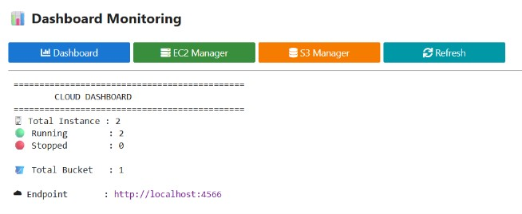
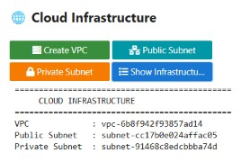
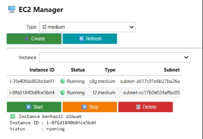
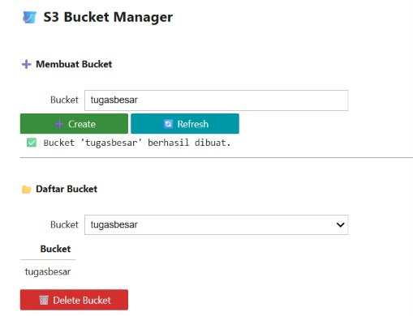

# ☁️ Cloud Resource Manager

**Simulation Platform for Amazon EC2 and Amazon S3 using MiniStack**

Cloud Resource Manager merupakan aplikasi berbasis **Jupyter Notebook** yang dikembangkan menggunakan **Python** dan **Boto3** untuk melakukan simulasi pengelolaan layanan **Amazon EC2** dan **Amazon S3** melalui **MiniStack**. Aplikasi ini menyediakan antarmuka interaktif menggunakan **ipywidgets** sehingga pengguna dapat mengelola infrastruktur cloud secara lokal tanpa memerlukan akun AWS.

---

## 📌 Features

### 📊 Dashboard
- Menampilkan ringkasan resource cloud
- Total EC2 Instance
- Running Instance
- Stopped Instance
- Total S3 Bucket
- Endpoint MiniStack

### 🌐 Cloud Infrastructure
- Create Virtual Private Cloud (VPC)
- Create Public Subnet
- Create Private Subnet
- View Infrastructure Information

### 🖥 EC2 Manager
- Create EC2 Instance
- Select Instance Type
- View Instance List
- Start Instance
- Stop Instance
- Delete Instance
- Refresh Instance Data

### 🪣 S3 Manager
- Create Bucket
- Delete Bucket
- View Bucket List
- Upload Object
- Download Object
- Delete Object
- Refresh Bucket Data

---

# 🏗 System Architecture

```
                    Cloud Resource Manager

                  Jupyter Notebook Interface
                           │
                        Python 3
                           │
                         Boto3 SDK
                           │
                     MiniStack Endpoint
                ┌──────────┴──────────┐
                │                     │
          Amazon EC2            Amazon S3
                │                     │
        Virtual Instance      Object Storage
```

---

# 📂 Project Structure

```
Cloud-Resource-Manager/
│
├── assets/
│   └── logo_unissula.png
│
├── docs/
│   ├── LAPORAN_TUGAS_BESAR.pdf
│   ├── MANUAL PENGGUNAAN APLIKASI.pdf
│   └── Screenshot/
│       ├── dashboard.png
│       ├── EC2_manager.png
│       ├── EC2_Satckport.png
│       ├── infrastruktur.png
│       ├── S3_Manager.png
│       ├── S3_Object_Stackport.png
│       ├── S3_Stackport.png
│       └── Upload_Object.png
│
├── notebook/
│   ├── Cloud_Resource_Manager.ipynb
│   └── setup.ipnyb
│
├── .gitignore
├── LICENSE
├── README.md
└── requirements.txt
```

---

# 🖥 Technologies Used

- Python 3
- Jupyter Notebook
- Boto3
- MiniStack
- StackPort
- ipywidgets
- Pandas

---

# 📦 Requirements

Install all required libraries before running the notebook.

```bash
pip install boto3
pip install pandas
pip install notebook
pip install ipywidgets
```

atau

```bash
pip install -r requirements.txt
```

---

# 🚀 Getting Started

## 1. Start MiniStack

Jalankan **StackPort** kemudian aktifkan **MiniStack** hingga status service berjalan.

---

## 2. Launch Jupyter Notebook

```bash
jupyter notebook
```

---

## 3. Open Notebook

Buka file

```
Cloud_Resource_Manager.ipynb
```

---

## 4. Run All Cells

Jalankan seluruh cell secara berurutan mulai dari konfigurasi hingga layout aplikasi.

---

## 5. Use the Application

Urutan penggunaan aplikasi:

1. Dashboard
2. Infrastructure
3. EC2 Manager
4. S3 Manager

---

# 📖 User Guide

## Dashboard

Dashboard menampilkan informasi:

- Total EC2 Instance
- Running Instance
- Stopped Instance
- Total S3 Bucket
- MiniStack Endpoint

---

## Infrastructure

Langkah pertama sebelum membuat EC2.

1. Create VPC
2. Create Public Subnet
3. Create Private Subnet
4. Show Infrastructure

---

## EC2 Manager

Fitur yang tersedia:

- Create Instance
- Select Instance Type
- Refresh Instance List
- Start Instance
- Stop Instance
- Delete Instance

---

## S3 Manager

Fitur yang tersedia:

- Create Bucket
- Delete Bucket
- Upload File
- Download File
- Delete Object
- Refresh Bucket

---

# 📷 Application Preview

Tambahkan screenshot berikut pada folder **docs/Screenshot/**

- Dashboard
- Infrastructure
- EC2 Manager
- S3 Manager

---

# 📚 Learning Objectives

Aplikasi ini dibuat sebagai media pembelajaran Cloud Computing untuk memahami:

- Cloud Infrastructure
- Amazon EC2
- Amazon S3
- Virtual Private Cloud (VPC)
- AWS SDK (Boto3)
- Object Storage
- Infrastructure as a Service (IaaS)

---

# 📋 Functional Modules

| Module | Description |
|---------|-------------|
| Dashboard | Monitoring cloud resources |
| Infrastructure | Create VPC and Subnet |
| EC2 Manager | Manage virtual instances |
| S3 Manager | Manage bucket and object storage |

---

# 🧪 Testing Result

| Feature | Status |
|---------|--------|
| Dashboard | ✅ |
| Create VPC | ✅ |
| Create Public Subnet | ✅ |
| Create Private Subnet | ✅ |
| Create EC2 Instance | ✅ |
| Start Instance | ✅ |
| Stop Instance | ✅ |
| Delete Instance | ✅ |
| Create Bucket | ✅ |
| Upload Object | ✅ |
| Download Object | ✅ |
| Delete Object | ✅ |

---

# 🎯 Future Development

Pengembangan selanjutnya dapat mencakup:

- Security Group Management
- Internet Gateway
- Route Table
- Elastic IP
- IAM Simulation
- RDS Simulation
- Lambda Simulation
- Resource Monitoring Chart
- CloudWatch Simulation
- User Authentication

---

# 👨‍💻 Author

**Cloud Resource Manager**

Simulation Platform for Amazon EC2 and Amazon S3 using MiniStack

Developed using:

- Python
- Jupyter Notebook
- MiniStack
- Boto3
- AWS Cloud Concepts

---

# 📄 License

This project is developed for educational purposes.

---












